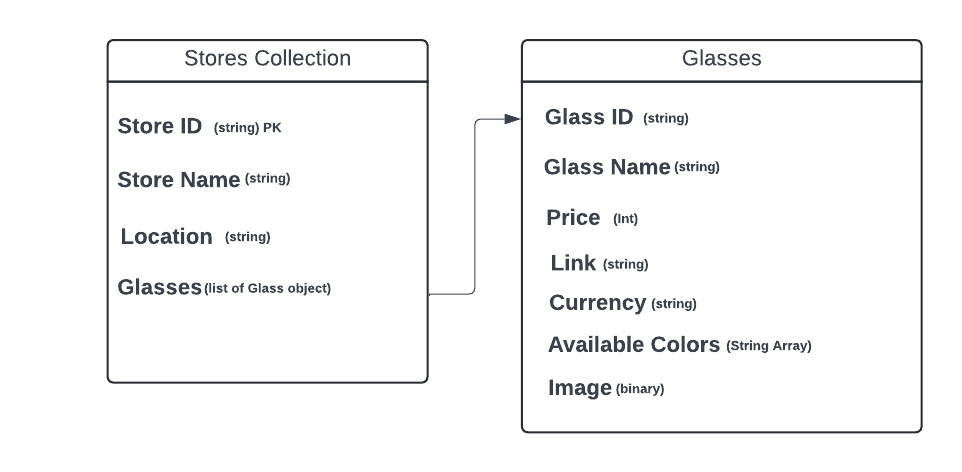

# Specommender

## Project Contributors
- Aabaran Paudel
- Yaghyesh Ghimire
- Ashok Timsina
- Bipana Bastola
 
Specommender is a platform for recommending eye glasses based on the shape of the face of the user. 

## Week 5: Database

**Specomender** uses a MongoDB-based database schema designed to manage, retrieve, and store data related to stores and glasses. Currently we provide a few CRUD functionalities in the database through a Command Line Interface. 

- Add Scraped data to the database
- Read the store data and explore a particular store
- Update Store Name
- Delete a particular store 

## Why MongoDB?

Each pair of glasses has attributes like colors, links, and images. MongoDB's flexible structure allows us to store all these details in a single document, making retrieval easy without needing complex joins like in SQL. In SQL, handling this kind of unstructured or semi-structured data requires complex queries, while MongoDB allows us to store all product details in one place.

MongoDB also scales horizontally, so as the number of glasses and stores grows, the database can handle larger volumes of data without performance loss. Moreover, it simplifies relationships by referencing store data using `Store ID`, without the complexity of foreign keys or joins that SQL databases typically require.

## Schema


## Collections

### 1. Stores Collection

This collection stores the details of stores where the glasses are available. It includes the following fields:

- `_id`: A unique identifier for each store.
- `store_name`: The name of the store.
- `store_address`: The address of the store.
- `store_contact`: contact number of the store
- `store_base_url`: web url of the store.
- `glasses`: Attribute for the glasses in the store.

### 2. Glasses Collection

This collection stores the details of individual glasses available in various stores. It includes the following fields:

- `_id`: A unique identifier for each pair of glasses.
- `Glass_Name`: The name/model of the glasses.
- `Price`: The price of the glasses.
- `Colors`: A list of colors available for the glasses.
- `Link`: A URL link to the product page.
-  `Shape`: shape (round, oval, etc.) of the glass
- `Image`: Image of the glasses.
- `store_id`: The ID of the store linked to this glass. 


## How to start and run the DataBase

1. Clone this repository to your machine and navigate to the project directory:  

   ```
   git clone https://github.com/bipana06/Final_Project_PPDS.git
   ```

3. Create a `.env` file in the project, including the MongoDB connection string:

    ```
    MONGODB_URI=mongodb+srv://<db_username>:<db_password>@<cluster_url>/<database_name>?retryWrites=true&w=majority&appName=<cluster_name>
    ```
4.  Install the required packages

  ```
    pip install -r requirements.txt
  ```

## Week 6: API

We've implemented the following functionalities via FastAPI for our application. Our endpoints allow for seamless interaction with the eyeglasses and stores database. Users can add new stores and glasses, update existing records, and delete them when necessary. Additionally, we provide endpoints to retrieve information about all available stores, search for specific glasses within a store based on their shape, and even search for glasses across all stores by name or price range. This comprehensive set of API functionalities ensures that users can efficiently manage the store and glasses data, making the application highly flexible and user-friendly.

Follow the steps given in **`How to start and run the DataBase`** to install all the dependencies. Then, 

## FastAPI server
You can then run the FastAPI server with `uvicorn main:app --reload` and access the FastAPI docs at `http://localhost:8000/docs` to test the endpoints. 

## Postman
Additionally, you can use our API in your postman. The following is how you can work with the endpoints. 

1. Add a New Store: `POST` request with `/add_store/`

This endpoint allows you to add a new store by providing store details (name, address, contact, base URL) in the request body.

2. Add a New Glass: `POST` request with `/add_glass/`

This endpoint allows you to add a new pair of glasses to a specific store by providing glass details (name, price, colors, link, shape, store ID) in the request body.

3. Get all records: `GET` request wtih `/stores/`.

This endpoint retrieves all the store records from the database, returning the details of every store.

4. Get glasses in a store: `GET` request with `/stores/{store_name}/glasses/`

Fetches all the glasses available in a specific store, organized by their frame shape (oval, round, square).

5. Get glasses in a store by shape: `GET` request with `stores/{store_id}/glasses/{frame_shape}`

Retrieves glasses from a specific store that match the given frame shape (e.g., oval, round, square).

6. Search glass: `GET` request with `/search_glass/`

Searches for glasses across all stores based on the glass name, price range, or shape provided as optional query parameters.

7. Update Store Information:
`PUT` request with `/update_store/{store_id}`

Use this endpoint to update the information of an existing store by providing the updated details in the request body. The store is identified by its store_id.

8. Update Glass Information: `PUT` request with `/update_glass/{glass_id}`

Use this endpoint to update the information of an existing glass by providing the updated details in the request body. The glass is identified by its glass_id

9. Delete Store:`DELETE` request with `/delete_store/{store_id}`

This endpoint deletes a store from the database using the provided store_id. It also removes all the associated glasses for that store.

10. Delete Glass: `DELETE` request with `/delete_glass/{glass_id}`

This endpoint deletes a specific glass from the database using the provided glass_id and updates the store's glasses list accordingly.
